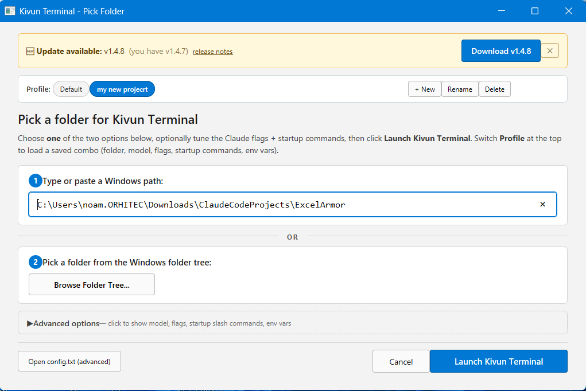

<p align="center">
  
</p>

<p align="center">
  
</p>

<p align="center">
  <video src="https://github.com/noambrand/launchpad-cli/releases/download/v2.6.9/claudecode-launchpad_v2.6.9.mp4" width="700" controls muted playsinline></video>
</p>

<p align="center">
  <em>📹 Demo: ClaudeCode Launchpad CLI - one-click install, folder picker, and launch -
  <a href="https://github.com/noambrand/launchpad-cli/releases/download/v2.6.9/claudecode-launchpad_v2.6.9.mp4">download MP4 (2.2 MB)</a>
  if your browser doesn't autoplay above.</em>
</p>

<p align="center">
  <a href="LICENSE"></a>
  <a href="https://github.com/noambrand/launchpad-cli/releases/latest"></a>
  
  
  <a href="https://github.com/noambrand/launchpad-cli/stargazers"></a>
  
  

</p>

<h3 align="center">Zero-to-Claude in 1 minute. Installer, status bar, and launcher for Claude Code on Windows & macOS.</h3>

<p align="center">
  <a href="#-quick-start">Quick Start</a> &bull;
  <a href="#-why-launchpad-cli">Why Launchpad CLI?</a> &bull;
  <a href="#-status-bar">Status Bar</a> &bull;
  <a href="#-architecture">Architecture</a> &bull;
  <a href="#-configuration">Configuration</a> &bull;
  <a href="docs/CHANGELOG.md">Changelog</a> &bull;
  <a href="TROUBLESHOOTING.md">Troubleshooting</a>
</p>

---

## Why Launchpad CLI?

|  | Manual Setup | Launchpad CLI |
|---|---|---|
| **Get Claude Code running** | Find Node.js, Git, and Claude installers, run them in order, fix PATH | One installer, one click |
| **Live status bar** (model, context %, usage) | Write your own statusline script + configure `settings.json` | Pre-installed |
| **Desktop shortcut + right-click "Open with..."** | Manual `.lnk` files + registry edits | Included |
| **Pick a folder before launching** | `cd` into every project | GUI picker dialog (browse tree or paste a path) |
| **Default Claude flags + startup slash commands** | Type them every session | Set once in the picker, reused every launch |
| **Named profiles per project** (folder + model + flags + env vars + startup slash-commands) | Track combos in your head, retype every session | 🆕 v2.6.0 — chip row at top of picker, click to switch; `ANTHROPIC_API_KEY` etc. masked in preview by default |
| **Time to first prompt** | 20+ minutes | ~1 minute |

<p align="center">
  <a href="https://github.com/noambrand/launchpad-cli/releases/latest/download/ClaudeCode_Launchpad_CLI_Setup.exe"></a>
  &nbsp;
  <a href="https://github.com/noambrand/launchpad-cli/releases/latest/download/ClaudeCode_Launchpad_CLI_Setup_mac.pkg"></a>
</p>

### Here's the picker you'll get

<p align="center">
  
</p>

The desktop shortcut opens this picker: pick a profile from the chip row at the top (or `+ New` to save the current setup as a named profile — folder + model + flags + startup commands + env vars), type/paste a Windows path or browse the tree, optionally pick a model (Opus / Sonnet / Haiku), tap chips for common options (Respond in Hebrew, High effort, Auto-accept file edits, Read-only, Don't fail if Opus is busy, Confirm before changes), and add startup slash commands like `/voicemode:converse` that get typed into Claude after it opens.

## Launchpad CLI vs Kivun Terminal — which one?

There are **two** projects in this family. Pick whichever fits how you work:

|  | **Launchpad CLI** *(this repo)* | **[Kivun Terminal wsl](https://github.com/noambrand/kivun-terminal-wsl)** |
|---|---|---|
| **Live status bar** (model, context %, usage) | ✅ | ✅ |
| **Light-blue Kivun theme** | ✅ Windows Terminal | ✅ Konsole |
| **Right-click "Open with..." on a folder** | ✅ Windows Explorer | ✅ Windows Explorer + Linux file managers |
| **Folder picker dialog with model + flag chips** | ✅ | ✅ |
| **Named profiles per project** (folder + model + flags + env vars + startup slash-commands) | ✅ v2.6.0 | ✅ v1.4.0 |
| **Hebrew / Arabic / Persian text right-aligned** | ❌ shows left-aligned | ✅ aligns to the right where it belongs |
| **English/code mixed inside a Hebrew sentence** | ❌ words pushed to the wrong edge | ✅ words land at the correct position in the sentence |
| **Supported RTL languages** | 0 (LTR only) | 11 (Hebrew, Arabic, Persian, Urdu, Pashto, Kurdish, Dari, Uyghur, Sindhi, Yiddish, Syriac) |
| **Startup time** | ~2 s | ~6 s |
| **Install size on Windows** | ~150 MB | ~2 GB *(includes Ubuntu + Konsole via WSL2)* |
| **Windows support** | Native (Windows Terminal) | WSL2 + Ubuntu + Konsole |
| **macOS support** | ✅ | ❌ Deprecated as of v1.2.4 *(no Mac terminal handles mixed Hebrew + English)* |
| **Linux support** | ❌ | ✅ apt / dnf / pacman / zypper |

> **Pick Launchpad CLI** if you work in English (or any LTR language), use macOS, or want the lightest fastest install.
> **Pick [Kivun Terminal](https://github.com/noambrand/kivun-terminal-wsl)** if you work in Hebrew, Arabic, Persian, Urdu, or another RTL language — or you're on Linux.

## Quick Start

### Windows

1. **[Download `ClaudeCode_Launchpad_CLI_Setup.exe`](https://github.com/noambrand/launchpad-cli/releases/latest)**
2. Run as Administrator - the wizard auto-detects what's already installed
3. Double-click the **"ClaudeCode Launchpad CLI"** desktop shortcut
4. Start coding with Claude

> **SmartScreen / antivirus note:** the installer isn't code-signed yet, so Windows SmartScreen may show *"Windows protected your PC"* (click **More info → Run anyway**) and some antivirus (e.g. McAfee) may warn. This is a **false positive**. Launchpad CLI is open-source (MIT) with [auditable source](https://github.com/noambrand/launchpad-cli), installs only official tools (Node.js, Git, Windows Terminal, and Claude via [Anthropic's official installer](https://claude.ai/install.cmd)), and deliberately avoids the download/elevation tricks antivirus watches for. You can scan the file yourself on [VirusTotal](https://www.virustotal.com/). More detail in [TROUBLESHOOTING](TROUBLESHOOTING.md#antivirus-or-smartscreen-flags-the-installer-false-positive).

### macOS

1. **[Download the `.pkg` installer](https://github.com/noambrand/launchpad-cli/releases/latest)**
2. Double-click it, allow in **System Settings > Privacy & Security**, then run again
3. Open **Terminal** and type `claude`
4. Start coding with Claude

> **First time?** You'll need a Claude Pro/Max subscription or [Anthropic API key](https://console.anthropic.com).

## Status Bar

A two-line live status bar at the bottom of every session:

> **BookWriter** | 🟢 Sonnet 4.6 | Context 🟩🟩🟩🟩🟩⬜⬜⬜⬜⬜ 51% | tokens: 284K | 24:13
>
> Session 🟨🟨🟨🟨🟨🟨🟨🟨⬜⬜ 77% resets in 4h15m &nbsp;|&nbsp; Weekly 🟩🟩⬜⬜⬜⬜⬜⬜⬜⬜ 16% resets in 6d18h

| Field | What it shows |
|-------|---------------|
| **Model** | Active Claude model (color-coded: green = Opus, yellow = Sonnet/Haiku) |
| **Context** | % of context window consumed (green/yellow/red) |
| **Tokens** | Combined input + output tokens this session |
| **Session / Weekly** | Usage limit % with countdown to reset |

## Voice Alerts

Short spoken clips so you don't have to watch the screen. Set up automatically and
**on by default** — each tied to the moment that actually means it:

| Alert | Plays when | Event |
|-------|-----------|-------|
| **done** | Claude has genuinely finished — nothing left to do | on-demand (Claude runs it) |
| **permission** | A genuine *allow this tool?* request (a file edit, a command) | `PermissionRequest` — real tool permissions only; question boxes & plan approval play *waiting* instead |
| **waiting** | Claude has been waiting on you (~60s idle), or a question / plan-approval prompt is up | `Notification` (idle) + reclassified prompts |
| **save** | Manual intervention — act by hand | on-demand |

**Regular or Funny mode** — every alert has a plain recording and a joke one (e.g. done:
*"Done."* vs *"Done. I'll pretend that took effort."*). Switch with **Regular Sounds ON** /
**Funny Sounds ON** or `node ~/.claude/sounds/voice.js mode regular|funny`.

An optional **repeat reminder** (off by default) re-plays the *waiting* clip every couple
of minutes once you've gone idle, until you respond. Playback uses Windows Media Player on
Windows (no PowerShell) and `afplay` on macOS — no Python, no extra installs.

Controls: double-click **Sound ON/OFF**, **Regular/Funny Sounds ON**, **Test Sounds** in
`~/.claude/sounds/`, or `node ~/.claude/sounds/voice.js on|off|mode <m>|repeat on|off|status`.
Full details: `~/.claude/sounds/README.md`.

### Turn all voice alerts off (one global switch)

The on/off setting is **global** — a single switch for **every project, every folder, and
every window**. It is **not** per-project and not per-profile. Turning it off silences
**all** of it: the four alerts *and* the repeat reminder.

Two ways to do it, no commands needed:

1. **In the launcher's picker** — open the launcher, expand **Advanced options → 🔊 Sound
   alerts**, and set **Sounds: Off**. It saves the instant you click, so you can just close
   the window; you don't have to start a session.
2. **Double-click `Sound OFF.cmd`** in `C:\Users\<you>\.claude\sounds`.

**When does it take effect?** Immediately — in every window that's already open, with **no
restart**. (The setting is re-read before every sound, so the very next alert obeys it.) It
also **survives updates and reinstalls**, so once it's off it stays off until you set it back
to **On** the same way. Nothing is removed or uninstalled — it's a reversible switch.

## Tech Stack

| Component | Technology | Purpose |
|-----------|-----------|---------|
| Windows installer | NSIS | Silent/wizard install with dependency detection |
| macOS installer | pkgbuild | .pkg with postinstall script via Homebrew |
| Launcher | Batch / Shell | Folder picker, flag passing, WT/CMD fallback |
| Terminal profile | Windows Terminal JSON Fragment | Custom "Noam" color scheme (#C8E6FF) |
| Status bar | Node.js (`statusline.mjs`) | Live model, context, and usage display |
| Config scripts | Node.js | WT settings injection, statusline setup |
| CI/CD | GitHub Actions | Automated macOS .pkg builds |

## Configuration

Set the terminal color right in the **folder picker → Advanced options** (with an **Apply now**
button that recolors Windows Terminal instantly), or edit `%LOCALAPPDATA%\Kivun\config.txt`:

```ini
RESPONSE_LANGUAGE=english     # 24+ languages supported
TERMINAL_COLOR=kivun          # kivun / dark / black / white / default, or a hex like #1e1e2e
CLAUDE_FLAGS=                 # e.g. --continue
```

## Contributing

Contributions are welcome! Areas where help is especially useful:

- **Installer testing** -- different Windows/macOS versions and locales
- **Windows on ARM** -- the NSIS installer is x64-only today
- **macOS notarization** -- the .pkg is currently unsigned; users on stricter Gatekeeper settings have to right-click → Open

> **Looking for Linux + RTL (Hebrew/Arabic/Persian)?** Use the sister project [kivun-terminal-wsl](https://github.com/noambrand/kivun-terminal-wsl) — Windows-via-WSL + Linux installers with full BiDi rendering.

Fork the repo, make your changes, and open a PR.

## Community

Submitted to awesome lists (pending review):

- [awesome-claude-code](https://github.com/jqueryscript/awesome-claude-code/pull/166)
- [awesome-claude](https://github.com/webfuse-com/awesome-claude/pull/159)
- [awesome-claude-plugins](https://github.com/quemsah/awesome-claude-plugins/pull/85)

## License

[MIT](LICENSE)

---

<p align="center">
  <strong>Made by <a href="https://github.com/noambrand">Noam Brand</a></strong>
  <br><br>
  <a href="https://github.com/noambrand"></a>
  <a href="https://www.linkedin.com/in/noambrand/"></a>
  <a href="https://www.facebook.com/noambbb/"></a>
  <a href="mailto:noambbb@gmail.com"></a>
</p>
